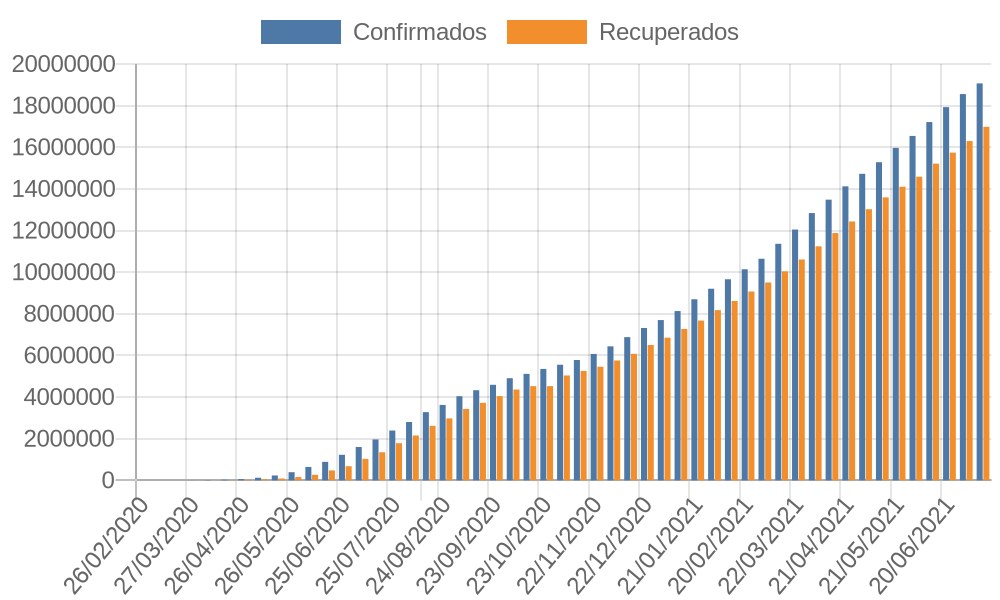
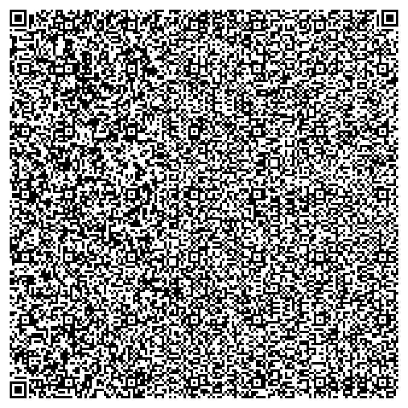

# Conteúdo basico de python
- Tipos de Variáveis
- Operadores
- Estruturas Sequenciais
- Estruturas Condicionais
- Estruturas de Repetições (while e for)
- Listas e Tuplas
- Strings
- Funções
- Manipulações de arquivos(.txt e .csv)

# Projeto
A foi consumido a API `https://api.covid19api.com/dayone/country/brazil`, após 
consumir e limpar os dados, tudo isso foi armazenado em um arquivo .csv para a
manipulação. Os dados foram utilizados para alimentar gráficos que foram feitos
com o site <https://quickchart.io> e por ultimo fiz um Qrcode com o mesmo site
para o acesso remoto do mesmo. Confira os resultados:

### Resultado do gráfico
###### Imagem 1 

### Veja também o Qrcode
###### Imagem 2
